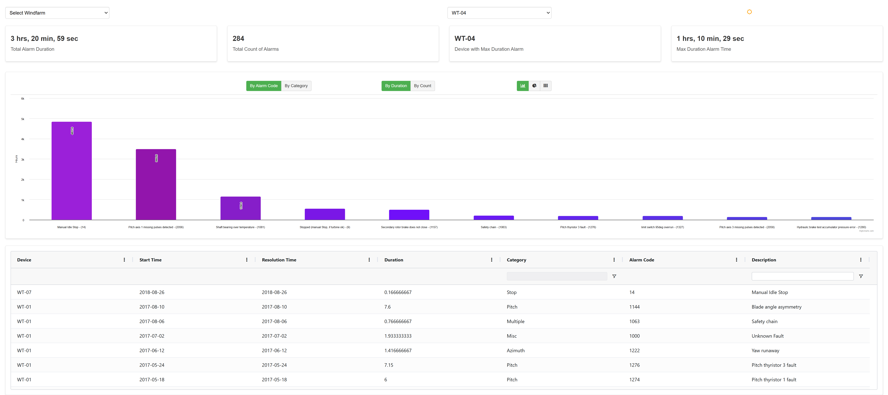

# Windfarm Dashboard

A simple windfarm dashboard UI that displays fault events from two windfarms named Mineapollis and Colorado.

## Table of Contents

- [Project Overview](#project-overview)
- [Folder Structure](#folder-structure)
- [Installation & Running the Application](#installation-&-running-the-application)
- [Technologies Used](#technologies-used)

## Project Overview
The project involves building a dashboard to analyze fault events across two windfarms, Mineapollis and Colorado, by visualizing data from two JSON files (`device.json` for devices and `fault.json` for fault events). The main features include:

1. **Page Level Filter**: Dropdown for selecting between Mineapollis and Colorado Windfarms.
2. **Additional Filters**: Options to filter by device name, time range, fault type, and alarm code.
3. **Tiles**: Display critical information like count and duration of alarms.
4. **Bar Charts**:
   - Top 10 Alarm Codes by Duration.
   - Top 10 Alarm Codes by Frequency.
5. **Pie Charts**:
   - Alarms by Category (Duration).
   - Alarms by Category (Frequency).
6. **Data Table**: A sortable and filterable table showing all fault event entries, with options for sorting by date, duration, alarm code, and description.
7. **Bonus Features**: Heat maps for Top 10 alarms and the option to containerize the app.

## Folder Structure

```plaintext
windfarm-dashboard/
├── src
│   ├── assets
│   │   ├── fault.json
│   │   └── device.json
│   ├── middleware
│   │   ├── BarChart.tsx
│   │   ├── DashBoard.tsx
│   │   ├── Dashboard.css
│   │   ├── DataTable.tsx
│   │   ├── HeatMap.tsx
│   │   ├── PieChart.tsx
│   │   ├── Tiles.tsx
│   │   ├── ToggleFilters.tsx
│   │   ├── WindFilter.tsx
│   │   └── WindFilter.css
│   ├── types
│   │   └── types.ts
│   ├── utils
│   │   ├── dataUtils.ts
│   │   └── theme.ts
│   ├── App.tsx
│   ├── main.tsx
│   └── index.css
├── index.html
├── package.json
├── pnpm-lock.yaml
├── README.md
└── tsconfig.json and other config files
```

## Installation & Running the Application

1. Clone the repository.
    ```bash
    git clone <repo_url>
    ```
2. Ensure you have Node installed.
3. Install pnpm
    ```bash
    npm install -g pnpm
    ```
4. Install the application dependencies.
    ```bash
    pnpm install
    ```
5. Build and run the application.
    ```bash
    pnpm build
    pnpm dev
    ```
    It will run on PORT: 5173, open http://localhost:5173/ in browser.

## Technologies Used
* Pnpm (Node Installed)
* React
* Highcharts
* ag-Grid


